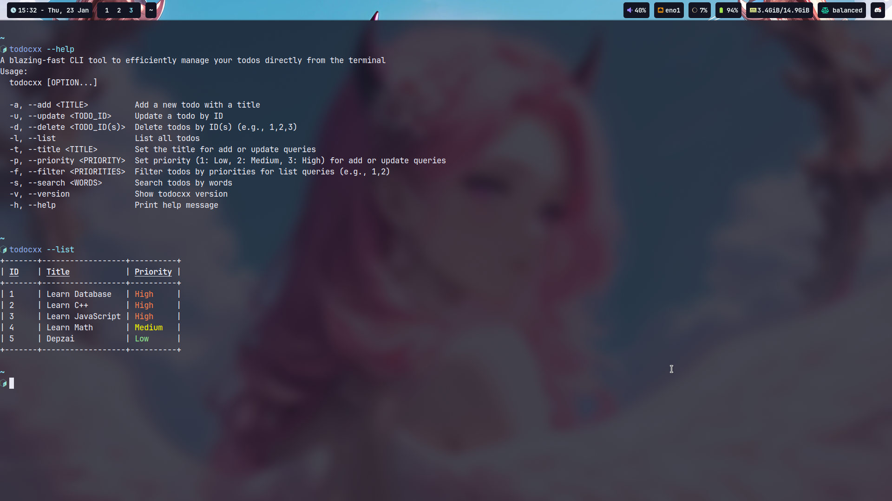

# 📝 todocxx

**todocxx** is a blazing-fast, terminal-based TODO application written in C++. Designed with simplicity and performance in mind, it empowers developers and terminal enthusiasts to efficiently manage their tasks through a clean and intuitive command-line interface.



## ✨ Features

- ➕ **Add**, 📜 **list**, ✏️ **update**, and ❌ **delete** TODOs effortlessly.
- 🌟 Assign priorities to tasks (🟢 Low, 🟡 Medium, 🔴 High) and filter them as needed.
- 🔍 **Search** tasks by keywords with support for case-insensitive matching.
- 📊 Dynamically formatted task table for better readability.
- 💨 Lightweight and fast, perfect for developers who love working in the terminal.

## 🛠️ Installation

### Prerequisites

Ensure you have the following installed:

- **C++17** or newer
- A compatible C++ compiler (e.g., `g++`, `clang++`)
- [fmt](https://fmt.dev/latest/index.html) library
- [cxxopts](https://github.com/jarro2783/cxxopts) (header-only)

### Build Instructions (Linux)

1. **Clone the repository**:

   ```bash
   git clone https://github.com/2giosangmitom/todocxx.git
   cd todocxx
   ```

2. **Build the project**:

   ```bash
   make
   ```

3. **Run the executable**:

   ```bash
   ./build/todocxx
   ```

## 🚀 Usage

**todocxx** provides a robust yet simple command-line interface for managing TODOs. Below is a summary of the available commands:

| Command                     | Description                                                     |
| --------------------------- | --------------------------------------------------------------- |
| `--help, -h`                | Display the help message                                        |
| `--version, -v`             | Display the application version                                 |
| `--add, -a <TITLE>`         | Add a new TODO with the specified title                         |
| `--list, -l`                | List all TODOs                                                  |
| `--update, -u <ID>`         | Update a TODO by ID (retains priority if not explicitly set)    |
| `--delete, -d <IDs>`        | Delete one or more TODOs by ID (e.g., `1,2,3`)                  |
| `--priority, -p <1-3>`      | Set or filter by priority (1: 🟢 Low, 2: 🟡 Medium, 3: 🔴 High) |
| `--filter, -f <PRIORITIES>` | Filter TODOs by multiple priorities (e.g., `1,2`)               |
| `--search, -s <KEYWORDS>`   | Search TODOs by keywords (case-insensitive)                     |
| `--title, -t <KEYWORDS>`    | Set the title when adding or updating TODOs                     |

## 💻 Examples

### ➕ Add a Task

```bash
./todocxx --add "Write documentation" --priority 2
```

### 📜 List All Tasks

```bash
./todocxx --list
```

### ✏️ Update a Task

```bash
./todocxx --update 1 --title "Revise project roadmap"
```

If `--priority` is omitted, the existing priority remains unchanged.

### ❌ Delete Tasks

```bash
./todocxx --delete 1,2
```

### 🔍 Search for Tasks

```bash
./todocxx --search "C++"
```

## 🤝 Contributing

We welcome contributions! To contribute:

1. Fork the repository.
2. Create a new branch for your feature or bug fix.
3. Submit a pull request when your changes are ready for review.

For significant changes, please open an issue first to discuss your idea.

## 📄 License

This project is licensed under the MIT License. For more details, refer to the [LICENSE](LICENSE) file.

## 🙏 Acknowledgments

This project is powered by the amazing work of:

- [fmt](https://fmt.dev/latest/index.html): A modern formatting library for C++.
- [cxxopts](https://github.com/jarro2783/cxxopts): A lightweight, header-only library for command-line option parsing.
